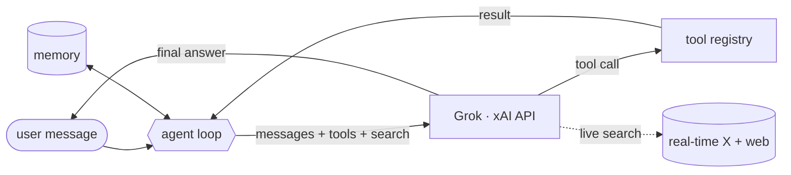

<h1 align="center">gboard</h1>

<p align="center">
  <strong>A real Grok agent — not a prompt dump, not a scraper.</strong><br />
  The agent loop on the official xAI API: tools, live search over X and the web, memory. Zero dependencies.
</p>

<p align="center">
  <a href="#license"></a>
  
  
  
  <a href="https://github.com/Roxx0x/gboard/actions/workflows/test.yml"></a>
</p>

## Why

Someone shipped a "Grok bot" last week. It was a text file of system prompts.

Someone else shipped one that scraped the web app for free access. It worked for four days, then xAI rotated something and it started returning nothing.

Both called themselves agents. Neither could run a tool, check a number, or tell you what was said on X an hour ago — the one thing Grok is actually for.

An agent isn't a prompt, and it isn't a scraper. It's a **loop**: the model answers, or it reaches for a tool or the live web, you run that, hand back the result, and it continues until the job is done. That loop — done correctly, on the official API, in a few hundred lines with nothing to install — is this repo.

## What it does

gboard is a CLI and a library, not a dashboard. You give it a message; it talks to Grok, runs tools when Grok asks, grounds answers in real-time X and the web, and remembers the conversation.

<p align="center">
  
</p>

| capability | what it means | touches the network |
|---|---|---|
| **agent loop** | iterative tool calls with a step cap — no runaway loops | via the model |
| **live search** | answers grounded in real-time X + web, at request time | yes, when on |
| **tools** | register a function + a schema; Grok decides when to call it | no (you run them) |
| **memory** | trimmed turn history + pinned facts that never fall out | no |

## How it works



One turn runs to completion: Grok answers, or asks for a tool — gboard runs it, hands back the result, and lets Grok continue until it's done or hits the step cap. Every call can be grounded in live search.

## Quickstart

```
pip install "git+https://github.com/Roxx0x/gboard"
```

```python
from gboard import Agent, search

agent = Agent(
    system="You are Grok, terse and accurate.",
    search=search("auto", x=True, web=True),   # ground answers in real-time X + web
)

print(agent.ask("what is 128 * 12?"))            # runs the calc tool, answers from the result
print(agent.ask("what's the latest from @xai?")) # live search over X
```

```
gboard ask "what is 21 * 2?"
gboard ask --trace "..."       # show the loop: steps, tools, live search, timing
gboard chat                    # interactive
gboard --no-search ask "..."   # plain completion
```

**No key? It still runs.** With no `XAI_API_KEY`, gboard uses an offline stub that mirrors the real tool round-trip — the demo and the whole test suite work with nothing installed. Set the key and `GBOARD_BACKEND=xai` for the real model.

## The part that's actually hard

Feeding a tool result back to the model is where most homemade agents silently break. The message shapes are fussy and a wrong one is a silent `400`. gboard uses the exact shapes, parses the JSON-string arguments back to real kwargs, catches tool errors instead of dying on them, and caps the steps so a confused model can't loop forever. The details, with diagrams, are in [docs/architecture.md](docs/architecture.md).

## Docs

- [architecture.md](docs/architecture.md) — the loop, the message shapes, the diagrams
- [live-search.md](docs/live-search.md) — grounding answers in real-time X and the web
- [tools.md](docs/tools.md) — writing a tool, and why `calc` doesn't use `eval`

## Limitations

Honest about what it is and isn't.

<details><summary><b>Model names change — check the default</b></summary>

The default model is `grok-4` (`GBOARD_MODEL`). xAI renames and retires models; before you rely on it, set it to whatever's current in the xAI docs.
</details>

<details><summary><b>Live search costs a round-trip</b></summary>

A searched answer fetches sources before the model responds, so it's slower and pricier than a plain one. `auto` keeps that cost off the questions that don't need it; force `off` for known-timeless queries.
</details>

<details><summary><b>The built-in memory is a trimmer, not long-term</b></summary>

It keeps a budgeted turn history plus pinned facts. That's the right default for a bot; it is not decay, association, or consolidation. For real long-term memory, inject a proper store — the interface is two methods.
</details>

<details><summary><b>Official API only</b></summary>

It does not scrape the web app, mass-register accounts, or bypass rate limits. That path gets you banned and your users' answers wrong. Bring an xAI key.
</details>

## Install and test

```
git clone https://github.com/Roxx0x/gboard && cd gboard
pip install -e ".[dev]"
pytest
python examples/demo.py       # tool call + memory + live search, offline
```

Python 3.9+, standard library.

## License

MIT. Build on it.
