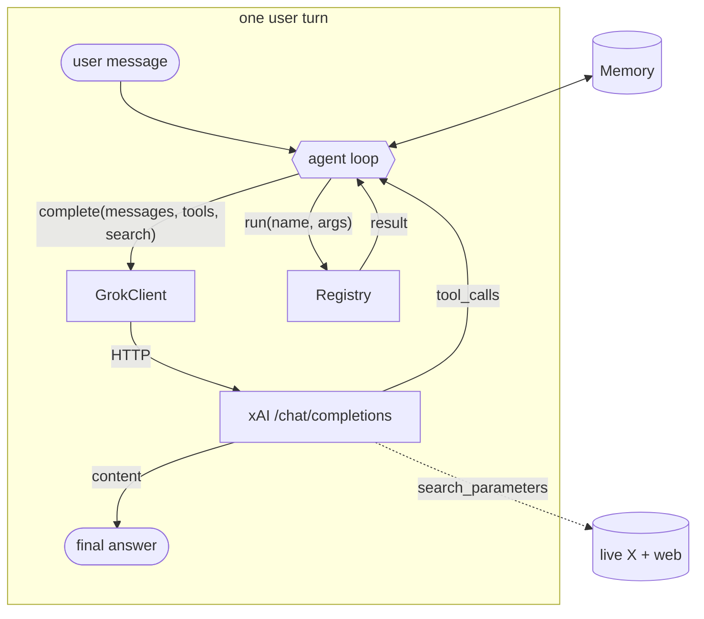

# Architecture

Five small modules and a loop. Nothing here is clever; the value is that it's
correct — the message shapes the API actually expects, a step cap so tools can't
loop forever, tool errors caught instead of fatal, and live search wired into
every call.



## The modules

| module | job |
|---|---|
| `client` | `urllib` POST to the xAI API; normalises the response; offline stub |
| `tools` | tool registry, JSON specs, dispatch; a sandboxed `calc` and a `now` |
| `livesearch` | builds the `search_parameters` object for real-time grounding |
| `memory` | trimmed turn history + pinned facts |
| `agent` | the loop that ties them together |

## The loop, precisely

`Agent.ask(message)`:

1. Add the user message to memory.
2. Build the working message list: `memory.messages(system)` (system prompt +
   pinned facts + trimmed turns).
3. Up to `max_steps` times, call the model with the tool specs and search params:
   - **No tool calls** → persist the answer to memory and return it.
   - **Tool calls** → append the assistant's tool-request message, run each tool,
     append each result, and loop.
4. If the step cap is hit, return a plain fallback rather than looping.

## The message shapes (the part that's easy to get wrong)

Feeding tool results back to an OpenAI-compatible API is fussy, and getting it
wrong produces silent 400s. gboard uses the exact shapes:

The assistant's request to call a tool:

```json
{
  "role": "assistant",
  "content": null,
  "tool_calls": [
    {"id": "call_1", "type": "function",
     "function": {"name": "calc", "arguments": "{\"expression\": \"128 * 12\"}"}}
  ]
}
```

Each result, keyed back by `tool_call_id`:

```json
{"role": "tool", "tool_call_id": "call_1", "content": "1536"}
```

`arguments` is a JSON **string**, not an object — a common mistake. The client
parses it back to a dict on the way in so your tool functions get real kwargs.

## What's persisted vs transient

Memory keeps clean `user` / `assistant` turns. The tool exchange (the assistant
tool-request message and the `tool` result messages) is transient to a single
`ask()` — it's needed for that turn's reasoning but would bloat the history, so it
isn't stored. Next turn starts from the clean transcript plus pinned facts.

## Swapping the pieces

Every collaborator is injected: pass your own `GrokClient` (different model or
timeout), `Registry` (your tools), `Memory` (a real long-term store), or `search`
config. The loop doesn't change. For durable memory — decay, association,
consolidation — point it at a proper store rather than the built-in trimmer.
